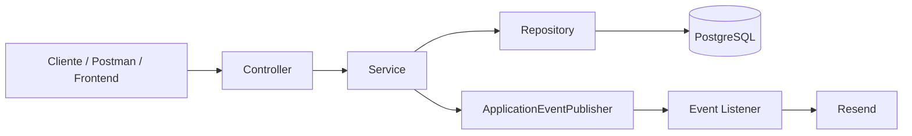
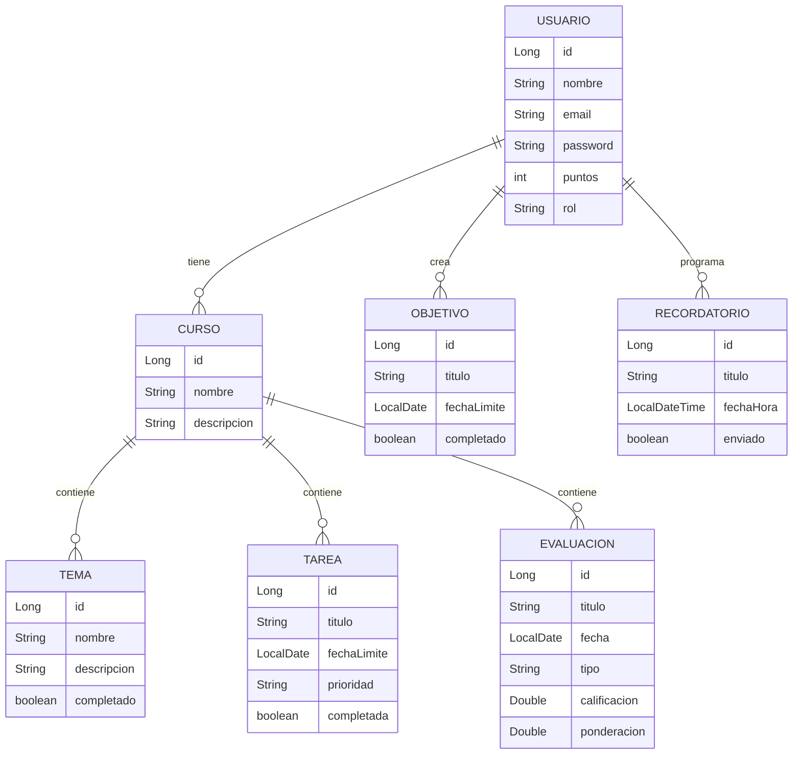

# StudyProgress

Backend para una aplicación web orientada a estudiantes universitarios que desean organizar sus cursos, tareas, evaluaciones, temas de estudio, objetivos académicos y recordatorios, además de visualizar su progreso y recibir notificaciones por correo.

## Tabla de contenidos

1. [Descripción general](#descripción-general)
2. [Problema y justificación](#problema-y-justificación)
3. [Objetivos](#objetivos)
4. [Solución propuesta](#solución-propuesta)
5. [Funcionalidades principales](#funcionalidades-principales)
6. [Tecnologías utilizadas](#tecnologías-utilizadas)
7. [Arquitectura](#arquitectura)
8. [Modelo de datos](#modelo-de-datos)
9. [Seguridad](#seguridad)
10. [Manejo de errores](#manejo-de-errores)
11. [Eventos y procesamiento asíncrono](#eventos-y-procesamiento-asíncrono)
12. [API y endpoints principales](#api-y-endpoints-principales)
13. [Instalación y ejecución local](#instalación-y-ejecución-local)
14. [Variables de entorno](#variables-de-entorno)
15. [Colección de Postman](#colección-de-postman)
16. [Gestión con GitHub](#gestión-con-github)
17. [Despliegue](#despliegue)
18. [Decisiones de diseño](#decisiones-de-diseño)
19. [Equipo](#equipo)
20. [Conclusiones](#conclusiones)
21. [Licencia y referencias](#licencia-y-referencias)

## Descripción general

StudyProgress es un backend desarrollado con Spring Boot para apoyar la organización académica de estudiantes universitarios. La aplicación permite registrar cursos, temas, tareas, evaluaciones, objetivos y recordatorios, además de calcular el progreso de cada curso y manejar un sistema simple de gamificación.

El backend expone una API REST protegida con JWT. Cada usuario trabaja únicamente con sus propios recursos y los endpoints administrativos están restringidos por rol. El proyecto también incorpora validaciones, manejo global de excepciones, envío de correos mediante Resend, eventos de aplicación y tareas asíncronas.

## Problema y justificación

Los estudiantes universitarios suelen distribuir su información académica entre calendarios, notas, plataformas institucionales y aplicaciones separadas. Esto dificulta tener una visión única del avance de cada curso, las actividades pendientes y los objetivos personales.

StudyProgress busca centralizar esta información en una sola plataforma. El usuario puede organizar sus cursos y actividades, registrar evaluaciones, marcar tareas y temas como completados, definir objetivos y programar recordatorios. El sistema también calcula indicadores de progreso que permiten observar de manera rápida cuánto se ha avanzado en un curso.

La solución se plantea como una API desacoplada del frontend, de manera que pueda ser consumida posteriormente por una aplicación web o móvil.

## Objetivos

El objetivo general es desarrollar un backend seguro y organizado que permita gestionar información académica de un estudiante y ofrecer una base sólida para una aplicación web.

Objetivos específicos:

- Gestionar cursos, temas, tareas, evaluaciones, objetivos y recordatorios.
- Proteger la información mediante autenticación JWT.
- Limitar el acceso a los recursos según el usuario autenticado.
- Implementar autorización por roles USER y ADMIN.
- Validar los datos de entrada antes de almacenarlos.
- Calcular el progreso académico por curso.
- Incorporar gamificación mediante puntos.
- Enviar recordatorios por correo.
- Aplicar eventos y procesamiento asíncrono para desacoplar responsabilidades.
- Mantener una arquitectura Controller → Service → Repository.

## Solución propuesta

StudyProgress utiliza una arquitectura en capas. Los controladores reciben las solicitudes HTTP, los servicios contienen la lógica de negocio y los repositorios se encargan de la comunicación con PostgreSQL mediante Spring Data JPA.

Los datos de entrada se reciben mediante Request DTOs y las respuestas se entregan mediante Response DTOs. Se utilizan mappers para convertir entidades JPA en objetos de respuesta, evitando exponer información interna o sensible.

La autenticación utiliza JWT. Después del login, el token contiene información como el identificador del usuario, correo y rol. Los endpoints protegidos requieren un Bearer Token válido.

## Funcionalidades principales

- Registro e inicio de sesión.
- Gestión de cursos.
- Gestión de temas por curso.
- Gestión de tareas por curso.
- Gestión de evaluaciones y calificaciones.
- Gestión de objetivos personales.
- Gestión de recordatorios.
- Cálculo de progreso por curso.
- Gamificación mediante puntos.
- Envío de correos con Resend.
- Roles USER y ADMIN.
- Manejo global de errores.
- Eventos personalizados.
- Procesamiento asíncrono.
- Scheduler para recordatorios pendientes.

## Tecnologías utilizadas

- Java 21.
- Spring Boot.
- Spring Web MVC.
- Spring Data JPA.
- Spring Security.
- Jakarta Validation.
- PostgreSQL.
- Maven.
- JWT mediante JJWT.
- BCrypt para contraseñas.
- Resend para envío de correos.
- Postman para pruebas de API.
- Git y GitHub para control de versiones.

## Arquitectura



La aplicación sigue separación de responsabilidades. Los controllers reciben y responden solicitudes, mientras que la lógica de acceso, autorización sobre recursos y operaciones principales se concentra en los services.

La inyección de dependencias se realiza principalmente mediante constructores. Esto disminuye el acoplamiento y facilita las pruebas y el mantenimiento.

## Modelo de datos

Las entidades principales son:

- Usuario: representa al usuario autenticado. Incluye nombre, email, contraseña cifrada, puntos y rol.
- Curso: pertenece a un usuario.
- Tema: pertenece a un curso y puede marcarse como completado.
- Tarea: pertenece a un curso e incluye fecha límite, prioridad y estado.
- Evaluacion: pertenece a un curso e incluye tipo, fecha, ponderación y calificación.
- Objetivo: pertenece a un usuario y puede marcarse como completado.
- Recordatorio: pertenece a un usuario e incluye fecha, hora y estado de envío.



## Seguridad

Spring Security trabaja en modo stateless. La aplicación no mantiene sesiones del servidor y utiliza JWT en el header Authorization.

El flujo de autenticación es:

1. El usuario realiza login.
2. Se compara la contraseña con BCrypt.
3. Se genera un JWT firmado.
4. El token incluye userId, email y role.
5. JwtAuthenticationFilter valida el token en las solicitudes protegidas.
6. Se crea el Authentication correspondiente dentro del SecurityContext.

Las rutas `/api/auth/**` son públicas. El resto requiere autenticación. Los endpoints `/api/usuarios/**` están restringidos al rol ADMIN y el UsuarioController también utiliza `@PreAuthorize("hasRole('ADMIN')")`.

CORS se encuentra configurado para permitir los frontends locales utilizados durante el desarrollo.

Las claves de base de datos, JWT y Resend se manejan mediante variables de entorno y no deben subirse al repositorio.

## Manejo de errores

La aplicación utiliza excepciones personalizadas y un `@RestControllerAdvice` global.

Entre las excepciones implementadas se encuentran:

- ResourceNotFoundException.
- DuplicateResourceException.
- InvalidOperationException.
- UnauthorizedException.
- ForbiddenOperationException.
- InvalidCredentialsException.
- ExternalServiceException.
- EmailSendException.

Las respuestas de error utilizan ErrorResponseDTO con:

- timestamp.
- status.
- error.
- message.
- path.

También se manejan errores de validación (`MethodArgumentNotValidException`), JSON inválido (`HttpMessageNotReadableException`) y errores inesperados.

## Eventos y procesamiento asíncrono

StudyProgress incorpora eventos personalizados mediante `ApplicationEventPublisher` y `@EventListener`.

Casos implementados:

- `UsuarioRegistradoEvent`: se publica después del registro.
- `ObjetivoCompletadoEvent`: se publica al completar un objetivo.
- `RecordatorioVencidoEvent`: se publica cuando el scheduler detecta un recordatorio pendiente cuya fecha ya llegó.

Se utiliza `@EnableAsync`, `@Async` y un `ThreadPoolTaskExecutor` para ejecutar tareas sin bloquear el hilo principal, especialmente operaciones relacionadas con correo.

El scheduler revisa periódicamente los recordatorios pendientes y publica eventos. El listener correspondiente procesa el envío por Resend y marca el recordatorio como enviado.

## API y endpoints principales

| Método | Endpoint | Descripción |
|---|---|---|
| POST | `/api/auth/registro` | Registrar usuario |
| POST | `/api/auth/login` | Iniciar sesión |
| GET | `/api/cursos` | Listar cursos |
| POST | `/api/cursos` | Crear curso |
| GET | `/api/cursos/{id}` | Obtener curso |
| DELETE | `/api/cursos/{id}` | Eliminar curso |
| GET | `/api/cursos/{cursoId}/temas` | Listar temas |
| POST | `/api/cursos/{cursoId}/temas` | Crear tema |
| PUT | `/api/temas/{id}/completar` | Completar tema |
| GET | `/api/cursos/{cursoId}/tareas` | Listar tareas |
| POST | `/api/cursos/{cursoId}/tareas` | Crear tarea |
| PUT | `/api/tareas/{id}/completar` | Completar tarea |
| GET | `/api/cursos/{cursoId}/evaluaciones` | Listar evaluaciones |
| POST | `/api/cursos/{cursoId}/evaluaciones` | Crear evaluación |
| PUT | `/api/evaluaciones/{id}/calificacion` | Registrar calificación |
| GET | `/api/objetivos` | Listar objetivos |
| POST | `/api/objetivos` | Crear objetivo |
| PUT | `/api/objetivos/{id}/completar` | Completar objetivo |
| GET | `/api/cursos/{cursoId}/progreso` | Obtener progreso |
| GET | `/api/recordatorios` | Listar recordatorios |
| POST | `/api/recordatorios` | Crear recordatorio |
| GET | `/api/recordatorios/pendientes` | Listar pendientes |
| DELETE | `/api/recordatorios/{id}` | Eliminar recordatorio |
| GET | `/api/usuarios` | Listar usuarios - ADMIN |

## Instalación y ejecución local

Requisitos:

- Java 21.
- Maven.
- PostgreSQL.
- Git.

Clonar el repositorio:

```bash
git clone URL_DEL_REPOSITORIO
cd StudyProgress
```

Crear en PostgreSQL una base de datos llamada:

```text
studyprogress
```

Configurar las variables de entorno requeridas y ejecutar:

```bash
mvn spring-boot:run
```

También puede ejecutarse directamente desde IntelliJ utilizando `StudyProgressApplication`.

Por defecto el backend trabaja en:

```text
http://localhost:8080
```

## Variables de entorno

La aplicación requiere:

```text
DB_PASSWORD
JWT_SECRET
RESEND_API_KEY
```

Ejemplo conceptual de `application.properties`:

```properties
spring.datasource.url=jdbc:postgresql://localhost:5432/studyprogress
spring.datasource.username=postgres
spring.datasource.password=${DB_PASSWORD}

jwt.secret=${JWT_SECRET}
jwt.expiration=86400000

resend.api-key=${RESEND_API_KEY}
resend.from-email=onboarding@resend.dev
```

No se deben subir claves reales al repositorio.

## Colección de Postman

En la raíz del repositorio se incluye:

```text
StudyProgress.postman_collection.json
```

La colección contiene los endpoints principales, ejemplos de request, variables y autenticación Bearer.

Variables principales:

- `baseUrl`.
- `token`.
- `email`.
- `password`.
- `cursoId`.
- `temaId`.
- `tareaId`.
- `evaluacionId`.
- `objetivoId`.
- `recordatorioId`.
- `usuarioId`.

El login almacena automáticamente el JWT en la variable `token`.

## Gestión con GitHub

El proyecto utiliza Git para control de versiones. Se recomienda desarrollar nuevas funcionalidades mediante ramas feature y utilizar commits descriptivos.

Ejemplos:

```text
Implement JWT authentication
Add validation and global exception handling
Add response DTOs and mappers
Implement async reminder events
```

El repositorio debe mantener `.gitignore` actualizado y evitar archivos locales, credenciales, `.env` y secretos.

Como mejora de integración continua se puede incorporar GitHub Actions para ejecutar automáticamente compilación y pruebas con Maven en cada push o pull request.

## Despliegue en Producción (AWS)

El backend de StudyProgress se encuentra completamente desplegado y operativo en la infraestructura en la nube de **Amazon Web Services (AWS)** bajo una arquitectura desacoplada de alta disponibilidad:

* **Documentación Interactiva Swagger UI:** [http://3.238.147.129:8080/swagger-ui.html](http://3.238.147.129:8080/swagger-ui.html)
* **URL Base de la API REST:** `http://3.238.147.129:8080/api/v1`

---

### Arquitectura de Despliegue en AWS

1. **Servidor de Aplicación (Amazon EC2):**
   * **Instancia:** `t3.micro` con Ubuntu Server.
   * **Runtime:** Contenedor Docker multi-stage optimizado sobre Eclipse Temurin 21 JRE Alpine.
   * **Firewall (Security Groups):** Puertos 22 (SSH administrativo) y 8080 (Ingreso público para peticiones HTTP y Swagger).

2. **Capa de Persistencia (Amazon RDS):**
   * **Motor:** PostgreSQL 16 administrado en instancia `db.t4g.micro`.
   * **Seguridad de Red:** Conexión aislada mediante Security Groups en el puerto 5432.
   * **Base de Datos Inicial:** `studyprogress_db` con mapeo automático de entidades JPA / Hibernate.

3. **Gestión de Variables de Entorno:**
   Siguiendo las mejores prácticas de seguridad, las credenciales no forman parte del repositorio y se inyectan en tiempo de ejecución del contenedor:
   * `SPRING_DATASOURCE_URL`: Cadena JDBC hacia el endpoint privado de Amazon RDS.
   * `SPRING_DATASOURCE_USERNAME`: Usuario maestro de la base de datos.
   * `SPRING_DATASOURCE_PASSWORD`: Contraseña protegida del clúster de datos.
   * `JWT_SECRET`: Clave criptográfica para la firma y verificación de tokens HMAC-SHA256.

---

### Ejecución Local para Desarrollo
Para levantar el entorno de base de datos localmente:
```bash
docker-compose up -d
./mvnw clean spring-boot:run
```

**URL de despliegue:** pendiente de completar.

## Decisiones de diseño

Se eligió JWT porque permite una API stateless y facilita la integración con un frontend separado.

Se utilizaron DTOs de entrada y salida para controlar qué información entra y sale de la API. Los mappers evitan devolver directamente las entidades JPA.

La lógica de negocio se concentra en los services para mantener controllers pequeños. Las comprobaciones de propiedad de recursos también se realizan en esta capa.

Los eventos permiten desacoplar acciones secundarias del flujo principal. Por ejemplo, el scheduler no necesita conocer los detalles del envío de correo: publica un evento y un listener se encarga del procesamiento.

Resend fue elegido como servicio externo de correo por su integración sencilla mediante API.

## Equipo

Curso: CS2031 - Desarrollo Basado en Plataformas  
Proyecto: StudyProgress  
Ciclo: 2026-2  
Grupo: Grupo 7


Integrantes:

- Pedro Maximo Chavez Oscanoa
- Marcelo Mateo Rosillo Rodriguez 
- Jorge Andrés Cuevas Sánchez
- Aquino Reyna Jesús Emmanuel
- Leonardo Martinez Aquino
## Conclusiones

StudyProgress implementa un backend orientado a la organización académica con una arquitectura en capas, autenticación JWT, autorización por roles, persistencia en PostgreSQL, validaciones, manejo global de excepciones, DTOs, eventos y procesamiento asíncrono.

La estructura desarrollada permite continuar el proyecto incorporando un frontend sin modificar la lógica principal. La separación entre controllers, services y repositories también facilita futuras pruebas, mantenimiento y ampliación de funcionalidades.

El proyecto cubre las operaciones centrales necesarias para organizar cursos y actividades académicas y deja una base preparada para nuevas funciones como filtros avanzados, estadísticas adicionales, mayor cobertura de pruebas y despliegue en producción.

## Licencia y referencias

Proyecto académico desarrollado para el curso CS2031 - Desarrollo Basado en Plataformas.

Referencias técnicas principales:

- Spring Boot Documentation.
- Spring Security Documentation.
- Spring Data JPA Documentation.
- PostgreSQL Documentation.
- JJWT Documentation.
- Resend Documentation.
- Postman Documentation.
